# Supply Chain Analytics in PowerBI
In this case study, I performed a Make vs Buy analysis in PowerBI. Before I dive into the project let me explain Supply Chain  and what Make vs Buy means so you'll be properly carried along.

Supply Chain is the network of individuals and companies that are involved in making a product and delivering it to the consumer and the Make vs Buy decision is choosing either to create a product in-house or to purchase it from an external supplier. Now we have these definitions out of the way let's dive right in!

## The Problem
The problem I worked on in this case study was to analytically determine a Make versus Buy decision for a fictitious company Tanate Industries that sells replacement parts for industrial pizza ovens. My task was to calculate the full cost of the Make and Buy Options so that the business could make an informed decision.

## Datasets and Data Model
The other analysts on the team started a PowerBI file by loading the data and creating a model but they need my help visualizing and interpreting the results. You can see the model below

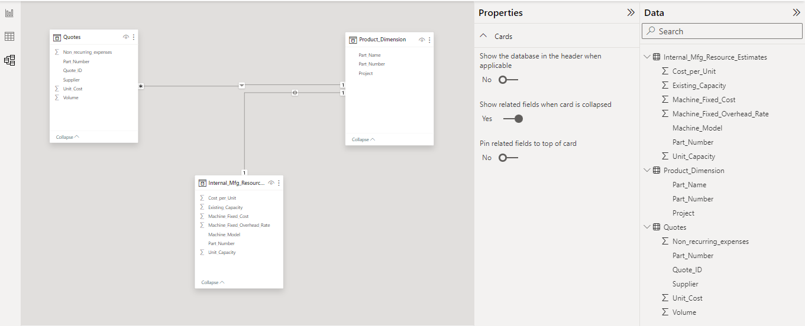

## Case Study Details

**BUY OPTION**

The Quotes dataset is our main table of interest for analyzing the Buy option. A quote is the supplier's price commitment for certain products and volumes. They say "If you buy X volume of this product you will pay 'Unit Cost' per unit and a one-time cost equal to 'Non-recurring-expenses' hence a quote is specific to a product, volume and supplier. 

We begin by setting the volume column's default summarization to 'Don't summarize' as PowerBI will automatically sum it up as it's a numeric field.

Let's look at selecting a supplier, supplier selection is a crucial part of the Buying option, and cost is an important factor to be considered, let me introduce the concepts of unit cost, extended cost and full cost and how they affect the supply chain decision-making process.

Unit cost refers to the cost of purchasing an additional unit and includes the manufacturer's raw material cost, production costs, and profit.

Extended cost represents the cost paid for the products only and does not include one-time expenses. Extended cost is the number of units purchased multiplied by the unit cost.

Non-recurring cost is a one-time cost that must be paid to facilitate production.

Full cost represents the total amount a company must pay to buy a certain quantity of products. Full cost is the sum of the extended cost and the non-recurring expenses.

Continuing in our case study analysis, I created two new columns (Extended cost and Full cost) in the Quotes Dataset because we need the full cost values in order to inform our purchasing decision. I formatted the newly created columns to currency with 2 decimal places and set the default summarization to 'Don't summarise'.

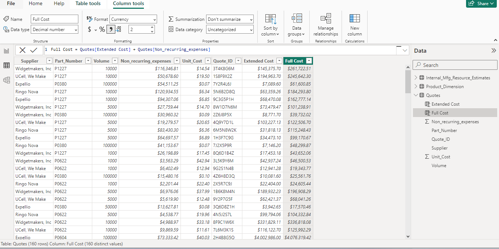

Our manager requested a report that shows: 

The supplier name with the lowest full cost for a part number and quote volume combination.

Visibility to all of the other supplier quotes and full cost for the part number. 

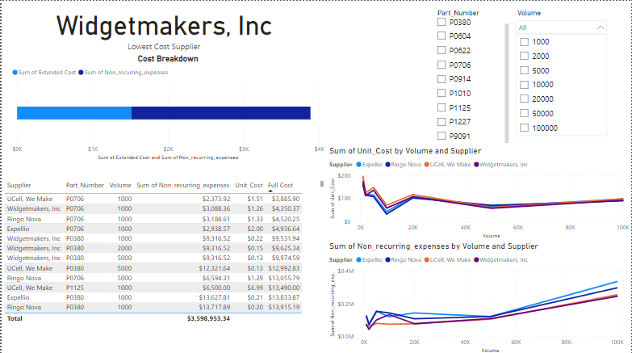

The above is a supplier selection report and it shows a card visual with the name of the supplier with the lowest full cost, with two slicers for volume and part number and a stacked bar chart with the title "Cost Breakdown" that displays the extended cost and non_recurring cost for the lowest cost supplier only, as well as other visuals( the table and the line charts) that give information on all of the other supplier quotes.

We've seen the full cost for the quoted minimum production volumes but in reality, it's unlikely to order exactly the number of products quoted, what happens if our company decides to order a volume that is different from the few points quoted? Let's fix that!

Using DAX, I created a scenario volume parameter that ranged from 1000 to 100,000 with increments of 500 and a default value of 15,000, I also used an iterative function (MINX) to create a "Scenario Full Cost" measure in the scenario volume table that calculates the minimum full cost for the given Scenario Volume Parameter, and using the Filter() function I made sure to filter the Quotes table to include only the quotes where the Scenario Volume Value is greater or equal to the quoted volume.
Scenario Volume Parameter                  | Scenario Full Cost Measure
:--------------------------------:|:-------------------------:
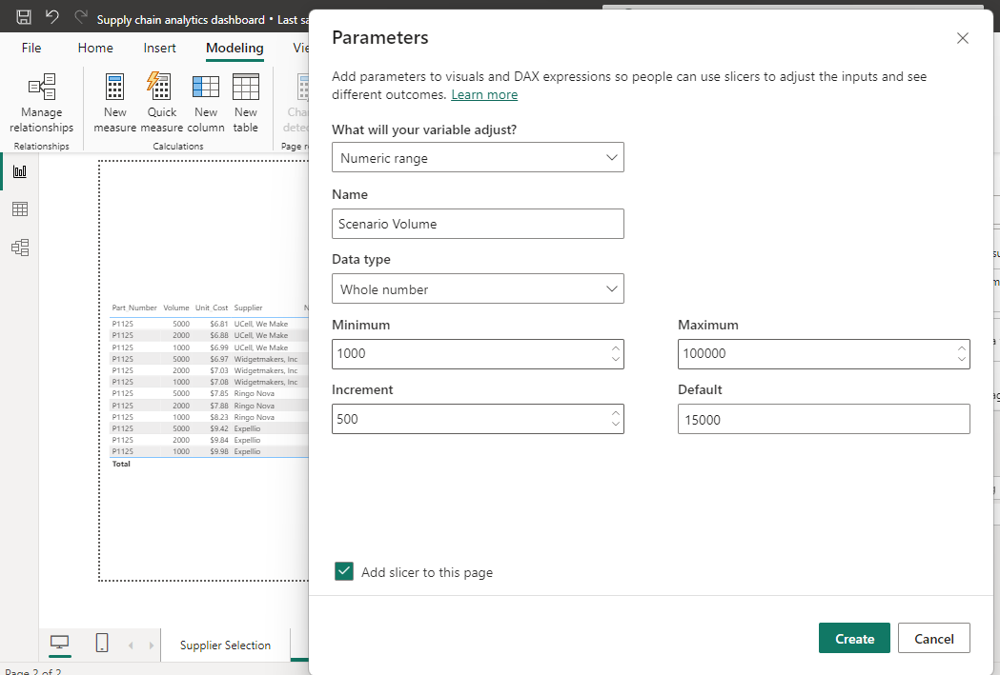             | 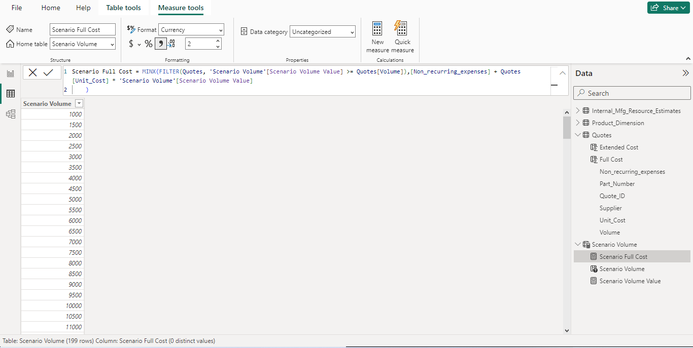

The finance team is interested in the breakdown between the non-recurring expenses for cash flow reasons. They would like the scenario planner to show the breakdown of those costs.

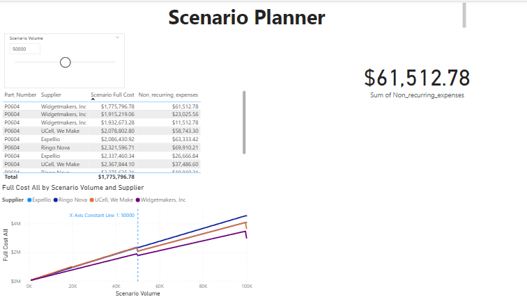

The report shows how the full cost for each supplier changes across all scenario volumes as well as the breakdown for the non-recurring expenses and I added a constant line to show where the scenario volume parameter falls in the range of potential values.

The supply chain team was impressed by the scenario planner tool and has requested some enhancements:
They want to see the lowest-cost supplier name prominently on the page 
They only want to see results relevant to their own project.

I adjusted the scenario planner report to meet the demands of the supply chain department and added row-level security so that each role can only see projects related to their specific project name.

Updated scenario planner               | Adding row-level security so they only see results relevant to their projects 
:---------------------:|:---------------------:
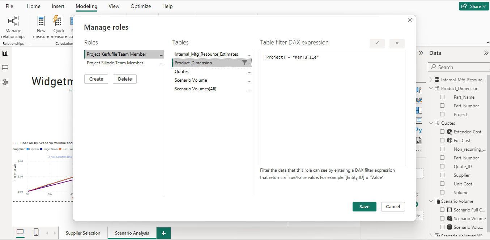  | 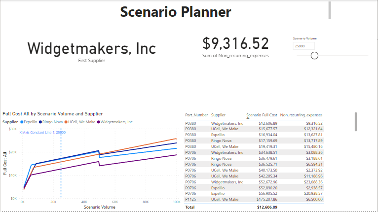

**MAKE OPTION**

Our main table of interest for the Make option is the Internal_Mfg_Resource_Estimates table and just like what we did for the Buy option we'll be calculating the full cost of production for the Make decision. The internal estimates for the Make option are similar to the quotes for the Buy decision and include unit cost and data about the equipment used to manufacture the parts. The unit cost comprises  raw materials, energy cost and labour cost.

The full cost for the make option is similar to the buy option. The full cost is the extended cost plus any incremental investment cost. 

Beginning the analysis for the Make option I created a measure "Additional Unit Capacity Required" using DAX that calculates excess production demand, I also created another measure "Capital Investment Required (Make)" which is the number of machines required multiplied by the cost of the machine. You should know that the number of machines required is the Additional Unit Capacity Required divided by the Unit Capacity per machine. Now we can calculate the full cost for the make option, I created a "Make Scenario - Full Cost" measure

Additional Unit Capacity| Capital Investment Required (Make)| Make Scenario Full Cost
:---------------------:|:-----------------------:|:---------------------:
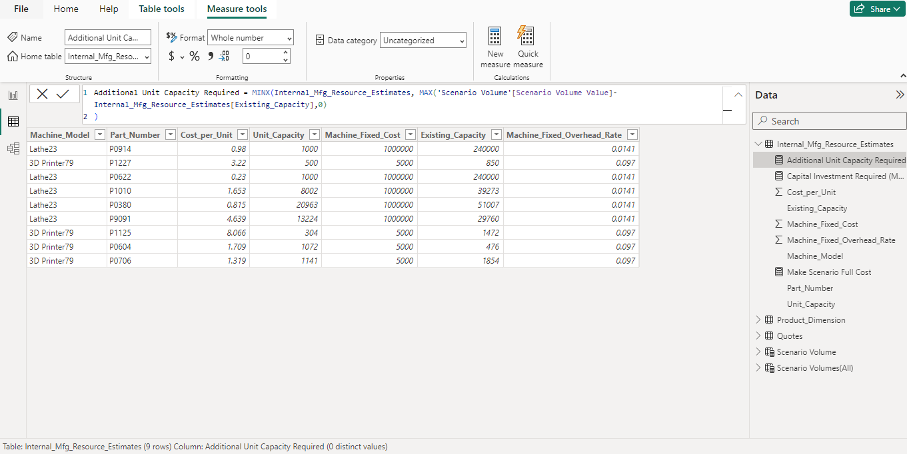|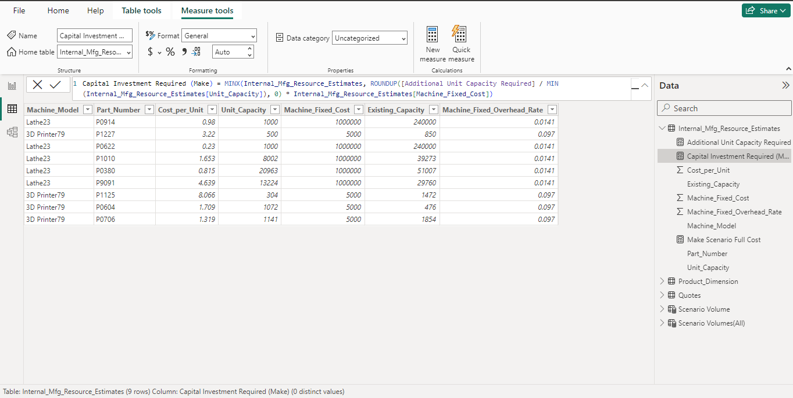|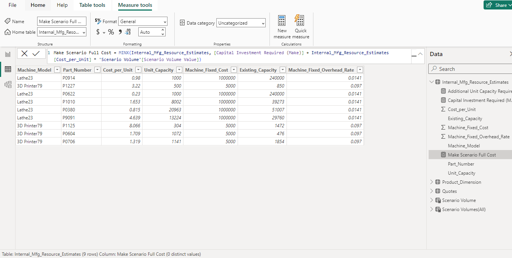

I went ahead to create other measures, a "Make vs Buy" measure and a "Cost Avoidance" measure that returns the positive impact of either the Make vs Buy option. 

## Recommendation
Marketing projects the demand for P0604 to be 48,000 units. Based on the scenario planner visualization, what volume would you recommend ordering?

I'll recommend that the team order 50,000 or slightly more because the full cost is actually less expensive once you cross the 50,000 unit threshold.  
